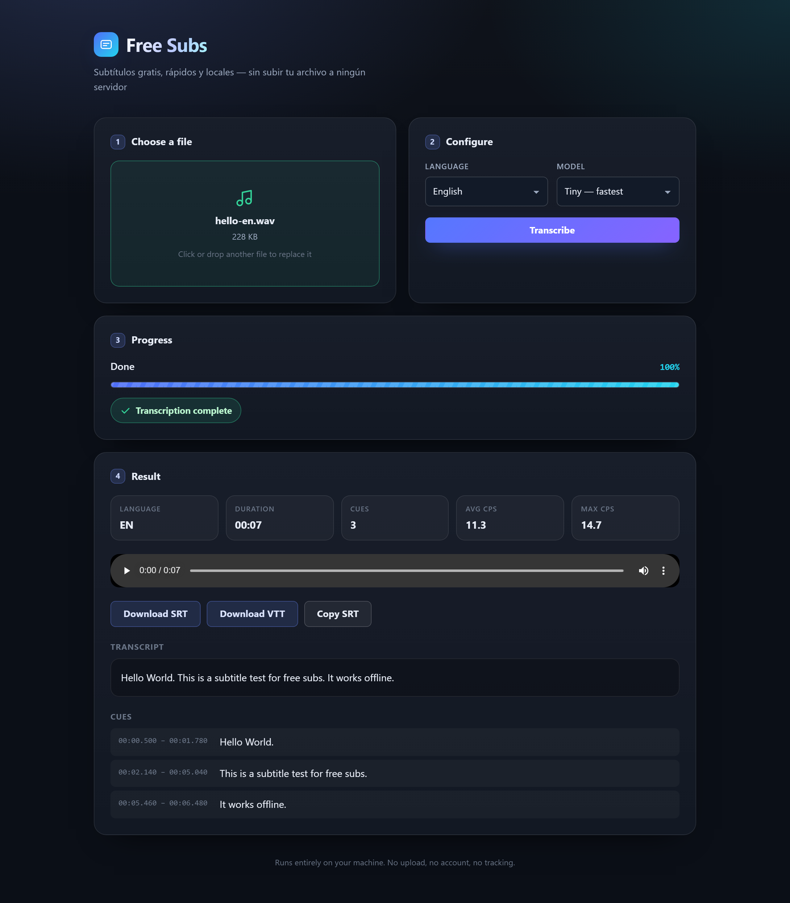

<div align="center">

# free-subs

**Free, fast, local subtitles in Spanish, English and Mandarin — with phonetics, real-time live mode, translation and video export.**
No cloud. No accounts. No per-minute fees. Your media never leaves your machine.

[](#development)
[](#development)
[](#development)
[](LICENSE)
[](tsconfig.base.json)



</div>

## Demos

| Subtítulos | Traducir | Exportar video |
| --- | --- | --- |
|  |  |  |

## What you can do

1. **Subtítulos** — drop a video/audio file and get SRT/VTT/ASS/JSON subtitles in Spanish, English or Mandarin, with **pinyin** (Mandarin) and **IPA** (English/Spanish) pronunciation.
2. **En vivo (beta)** — live subtitles from your microphone with near-real-time translation (LocalAgreement-2 streaming, ~2–3 s behind speech).
3. **Traducir** — context-aware translation between the three languages (cues are translated in blocks).
4. **Exportar video** — style the subtitles with a live preview and burn them into an MP4.

Built for learners and for apps that need a subtitle engine: **study JSON**, **batch mode**, **per-line audio clips**, **pinyin + tone sandhi**, **IPA**, light/dark theme, CLI, local-only processing.

## Quick start

Requirements: **Node 20+**. `ffmpeg` is needed for non-WAV input, video export and clips (the Gyan "full" build includes libass).

```bash
npm install
npm run build
npm start
# open http://localhost:8787
```

The first transcription downloads the Whisper model (default `base`, ~150 MB) and the first translation downloads an OPUS-MT model (~80 MB) into `.cache/models`. Override with `FREE_SUBS_CACHE_DIR`.

### CLI

```bash
node dist/cli.js video.mp4 -l es -m base -o subtitulos.srt        # subtitles
node dist/cli.js video.mp4 -l en -t es                            # translate to Spanish
node dist/cli.js video.mp4 -l en -t es --burn salida.mp4          # burn translated subs
node dist/cli.js song.mp3 -l es -m small --vocals -f json         # study JSON (music mode)
node dist/cli.js ./carpeta --batch -f json -t es,en,zh -m small   # batch: one JSON per file
```

| Option | Description | Default |
| --- | --- | --- |
| `-l, --language <code>` | `auto`, `es`, `en`, `zh` | `auto` |
| `-m, --model <id>` | `tiny`, `base`, `small` | `base` |
| `-f, --format <fmt>` | `srt`, `vtt`, `ass`, `json` | `srt` |
| `-t, --translate <langs>` | translate, comma-separated (`es,en,zh`) | — |
| `--vocals` | music mode: isolate the centre channel | — |
| `--burn <output>` | burn subtitles into the video (mp4) | — |
| `--batch` | process every media file in a directory | — |
| `-o, --output <path>` | output file or directory | next to the input |
| `--stdout` | print subtitles to stdout | — |

## Live mode (beta)

The **En vivo** card captures your microphone (16 kHz PCM via AudioWorklet), streams it over a WebSocket
(`/api/live`) and shows live subtitles plus translations. Architecture follows the 2023–2026 streaming
research (see [docs/research/bio-inspired-and-phonetics.md](docs/research/bio-inspired-and-phonetics.md)):

- **LocalAgreement-2** commits only the longest common prefix of two consecutive hypotheses (arXiv:2307.14743).
- **VAD segmentation** finalizes a cue after ~0.6 s of silence; long speech is force-cut at 7 s.
- **Translation runs on finalized cues only** — full-sentence context, append-only, ~30–150 ms per cue on CPU.
- Typical latency: partials ~2–3 s behind speech; final + translation right after the pause.
- Everything runs locally; the model (`tiny` recommended) stays in memory while the session is open.

WebSocket protocol (frozen): client sends `{"type":"start",language,model,translateTo}`, then binary
Float32 PCM frames, `flush` and `stop`; server emits `ready`, `partial`, `final`, `translation`, `status`, `error`.

## Study JSON (stable contract)

`--format json` and `GET /api/jobs/:id/download?format=json` return the same document:

```json
{
  "version": 1,
  "language": "es",
  "durationMs": 12345,
  "cues": [
    {
      "startMs": 0,
      "endMs": 1500,
      "lines": ["Hola mundo"],
      "words": [{ "text": "Hola", "startMs": 0, "endMs": 500 }],
      "ipa": "ˈola ˈmundo"
    }
  ],
  "translations": {
    "zh": { "cues": [ { "startMs": 0, "endMs": 1500, "lines": ["你好，世界"], "words": [], "pinyin": "ní hǎo, shì jiè" } ] }
  }
}
```

- `words` is always an array (empty when there are no word timings).
- `pinyin` appears for Chinese (`zh*`) cues and Chinese translations — with **tone sandhi applied**
  (`你好 → ní hǎo`, `展览馆 → zhán lán guǎn`).
- `ipa` appears for English/Spanish cues and translations (CMUdict + ARPAbet→IPA for English;
  rule-based G2P with stress for Spanish).
- `translations` includes every translation that is done. SRT/VTT/ASS are unchanged.

**Per-line audio clips:** `GET /api/jobs/:id/clip?startMs=…&endMs=…` → `audio/mp4` (m4a), max 120 s, cut from the uploaded media. Perfect for flashcards with audio.

## Models

| Model | Speed | Quality | Best for |
| --- | --- | --- | --- |
| `tiny` | ⚡⚡⚡ | ★★ | live mode, quick drafts, low-end machines |
| `base` | ⚡⚡ | ★★★ | everyday speech (default) |
| `small` | ⚡ | ★★★★ | difficult audio, accents, **music** |

Translation runs fully locally with OPUS-MT models (es↔en, en↔zh; es↔zh pivots through English) and translates cue **blocks** so context is preserved.

## How it works

```
audio/video ─► decode ─► loudness ─► VAD ─► [music mode] ─► Whisper ─► post-process ─► cue engine ─► SRT/VTT/ASS/JSON
microphone  ─► AudioWorklet ─► WebSocket ─► LocalAgreement-2 ─► finals ─► OPUS-MT ─► live subtitles + translation
                                                                                        └─► export ─► ASS + ffmpeg/libass
```

| Algorithm | What it does | Basis |
| --- | --- | --- |
| Adaptive VAD | RMS + zero-crossing, percentile noise floor, hangover, gap merging | arXiv:2501.11378 |
| Hallucination guards | de-looping, bag-of-hallucinations (EN+ZH), drop tokens < 50 ms | arXiv:2501.11378, arXiv:2408.16589 |
| Timestamp refinement | median smoothing, monotonic repair, snapping to VAD edges | WhisperX, arXiv:2303.00747 |
| Conservative denoise | decision-directed Wiener, −15 dB floor, SNR-gated dry/wet | arXiv:2406.12699, arXiv:2201.06685 |
| Music mode | 80 Hz high-pass + centre-channel extraction (mid/side spectral masking) | center-channel extraction |
| Loudness | active-speech RMS to −20 dBFS, peak guard | ITU-R BS.1770, EBU R128 |
| Balanced wrapping | DP minimizes the longest line; kinsoku for CJK | broadcast practice, W3C clreq |
| Reading speed | CPS caps (17 latin / 9 CJK), durations, gaps | Netflix TTSG, BBC guidelines |
| Live streaming | LocalAgreement-2, min-chunk 1 s, finals-only translation | arXiv:2307.14743 |
| Block translation | consecutive cues translated together, split back proportionally | WMT 2019 |
| Mandarin phonetics | tone sandhi (3rd tone right-to-left, 一/不) | pinyin-pro + our pass |
| English/Spanish phonetics | CMUdict → IPA with stress; rule-based Spanish G2P | CMUdict, Spanish allophony rules |

## Measured quality (honest numbers)

On a deliberately hard test — a reggaeton track with dense instrumentation — compared against the published lyrics:

| Configuration | WER vs lyrics |
| --- | --- |
| `base` | 65.1% |
| `base --vocals` | 64.5% |
| `small` | 51.5% |
| `small --vocals` | 53.4% |

Takeaways: **model size is the dominant factor for sung audio**; music mode's DSP is measurable (≥ 6.8 dB side-channel attenuation, bass removal) but its ASR benefit depends on the mix. For songs, use `-m small --vocals`; for speech, the defaults are already strong.

## API

| Method | Route | Description |
| --- | --- | --- |
| `GET` | `/api/health` | service status |
| `GET` | `/api/models` | models, languages, fonts, default export style |
| `POST` | `/api/jobs?language=&model=&vocals=&filename=` | upload media (raw body) → `{ id }` |
| `GET` | `/api/jobs/:id` | status, progress, result, translations, exports |
| `PATCH` | `/api/jobs/:id/cues` | edit cue texts (order-based) |
| `POST` | `/api/jobs/:id/translate` | `{ "to": "zh" }` → local translation |
| `POST` | `/api/jobs/:id/export` | `{ "style": { ... } }` → burn subtitles into MP4 |
| `GET` | `/api/jobs/:id/download?format=srt\|vtt\|ass\|json[&lang=es]` | subtitles or study JSON |
| `GET` | `/api/jobs/:id/clip?startMs=&endMs=` | per-line audio clip (m4a) |
| `GET` | `/api/exports/:exportId` · `/download` | export status and MP4 |
| `WS` | `/api/live` | live subtitles + translation (protocol above) |

## References

The engine adapts published research and broadcast standards. A curated research log lives in
[docs/research/bio-inspired-and-phonetics.md](docs/research/bio-inspired-and-phonetics.md)
(including the honest verdict on bat-inspired translation).

**Speech recognition & robustness**
- Whisper — [arXiv:2212.04356](https://arxiv.org/abs/2212.04356)
- Whisper hallucinations & VAD/de-loop/BoH (ICASSP 2025) — [arXiv:2501.11378](https://arxiv.org/abs/2501.11378)
- Careless Whisper (FAccT 2024) — [arXiv:2402.08021](https://arxiv.org/abs/2402.08021)
- CrisperWhisper (Interspeech 2024) — [arXiv:2408.16589](https://arxiv.org/abs/2408.16589)
- WhisperX (Interspeech 2023) — [arXiv:2303.00747](https://arxiv.org/abs/2303.00747)

**Streaming & translation**
- Whisper-Streaming / LocalAgreement-2 (IJCNLP-AACL 2023) — [arXiv:2307.14743](https://arxiv.org/abs/2307.14743)
- Simul-Whisper (Interspeech 2024) — [arXiv:2406.10052](https://arxiv.org/abs/2406.10052)
- OPUS-MT (EAMT 2020) — [aclanthology 2020.eamt-1.21](https://aclanthology.org/2020.eamt-1.21/)
- Customizing NMT for Subtitling (WMT 2019) — [W19-5209](https://aclanthology.org/W19-5209/)

**Enhancement & audio conditioning**
- Speech-enhancement artifacts harm ASR — [arXiv:2201.06685](https://arxiv.org/abs/2201.06685)
- Output alignment / dry-wet mixing — [arXiv:2406.12699](https://arxiv.org/abs/2406.12699)
- ITU-R BS.1770 / EBU R128 · Boll 1979 · Scalart & Filho 1996 · Martin 2001

**Phonetics, typography & bio-inspired (and what does not exist)**
- CMUdict — [cmusphinx/cmudict](https://github.com/cmusphinx/cmudict) · ipa-dict — [open-dict-data/ipa-dict](https://github.com/open-dict-data/ipa-dict)
- pinyin-pro (tone sandhi) — [zh-lx/pinyin-pro](https://github.com/zh-lx/pinyin-pro)
- EchoSpeech sonar glasses (CHI 2023) — [ACM](https://dl.acm.org/doi/fullHtml/10.1145/3544548.3580801)
- Netflix TTSG ([English](https://partnerhelp.netflixstudios.com/hc/en-us/articles/215758617), [Chinese](https://partnerhelp.netflixstudios.com/hc/en-us/articles/215986007)) · [BBC guidelines](https://www.bbc.co.uk/accessibility/forproducts/guides/subtitles/) · [W3C clreq](https://www.w3.org/TR/clreq/)
- **No bat-language translation system exists**; echolocation-inspired SSIs decode small command sets, not open speech. Neural G2P / MMS alignment / GOP scoring have no offline JS implementation (documented).

## Development

Built with TDD: **465 unit tests** (Vitest, 81% line coverage on core/pipeline/server) and **12 Playwright E2E tests** that drive a real browser against the real models — transcribing, translating, editing cues, downloading study JSON, serving clips, live streaming from a fake microphone, toggling themes and exporting a real MP4 with burned-in subtitles.

```bash
npm test            # unit tests
npm run test:coverage
npm run test:e2e    # end-to-end (real models, real ffmpeg, fake mic)
npm run fixtures    # regenerate speech fixtures (Windows TTS)
npm run dev         # dev server + Vite HMR
npm run typecheck
```

## Roadmap

- [ ] Optional larger model (large-v3-turbo) for maximum quality
- [ ] NLLB-200 direct es↔zh engine (pluggable translator)
- [ ] Folder watching for batch mode
- [ ] Phonetic search across subtitles (design ready in the research log)
- [ ] Speaker diarization

## Español

**Subtítulos gratis, rápidos y 100% locales en español, inglés y mandarín.**

- **Subtítulos**: SRT/VTT/ASS/JSON con tipografía profesional, **pinyin con sandhi tonal** y **IPA** (inglés/español).
- **En vivo (beta)**: subtítulos desde tu micrófono con traducción casi en tiempo real (~2–3 s).
- **Traducir**: entre los tres idiomas con contexto (bloques de cues), sin nube.
- **Exportar video**: estilos con vista previa en vivo y quemado en MP4.
- **Para apps de estudio**: JSON estable, **modo batch por carpeta** y **clips de audio por línea**.
- **Modo música**: aísla la voz del acompañamiento. **Modo claro/oscuro** automático.

```bash
npm install && npm run build && npm start   # http://localhost:8787
node dist/cli.js ./carpeta --batch -f json -t es,en,zh
```

## License

MIT © jdsalasca
